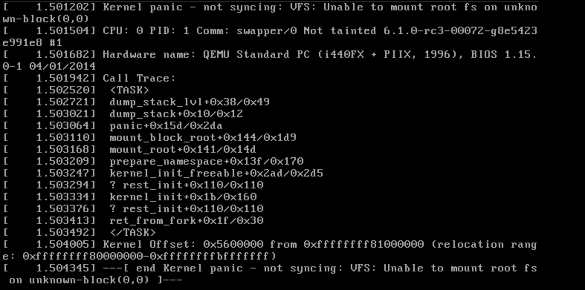
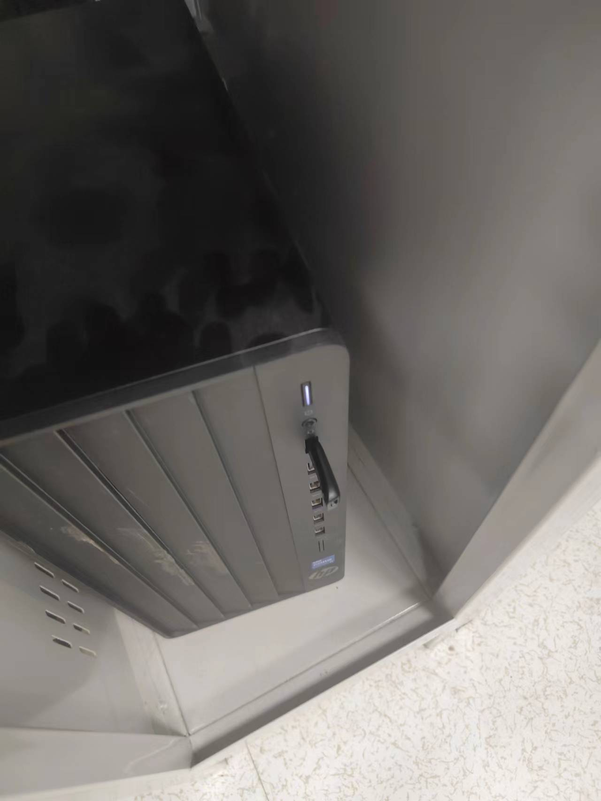
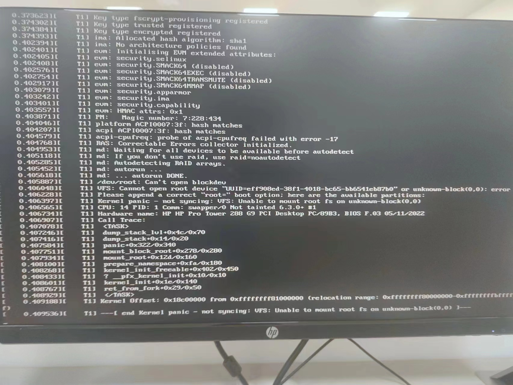
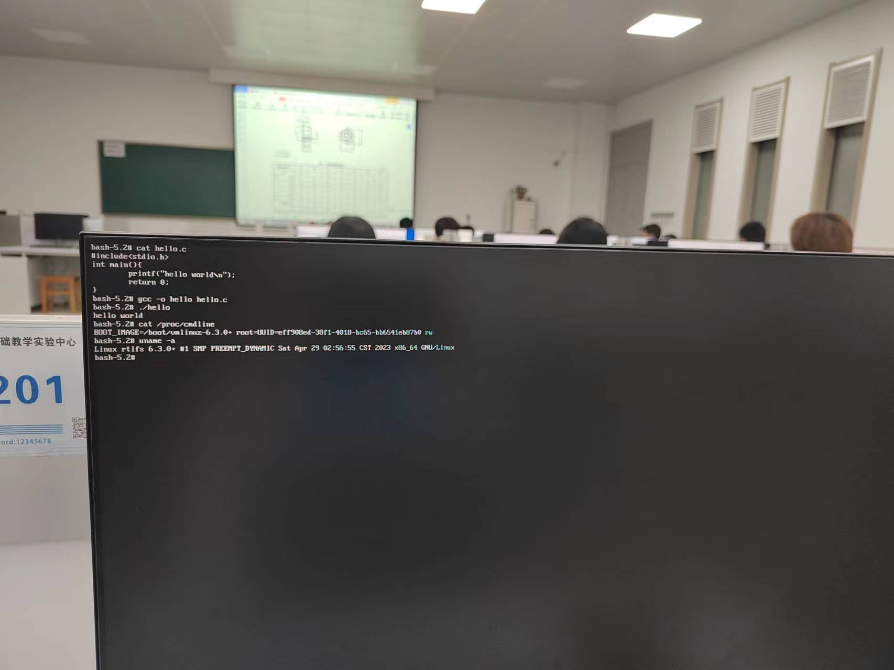
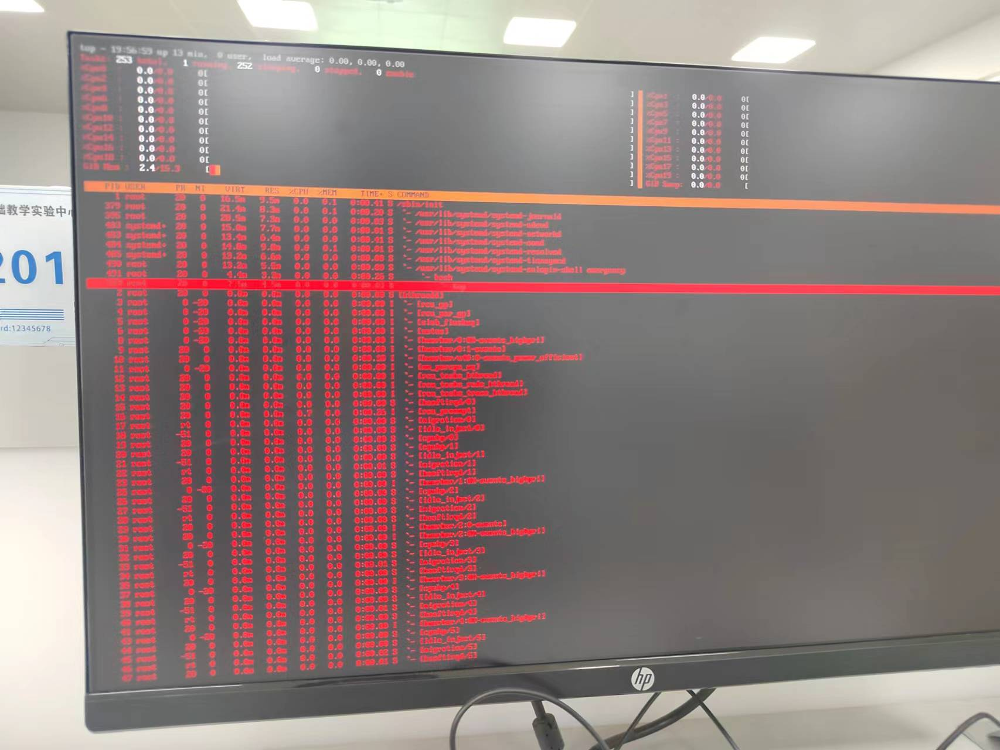
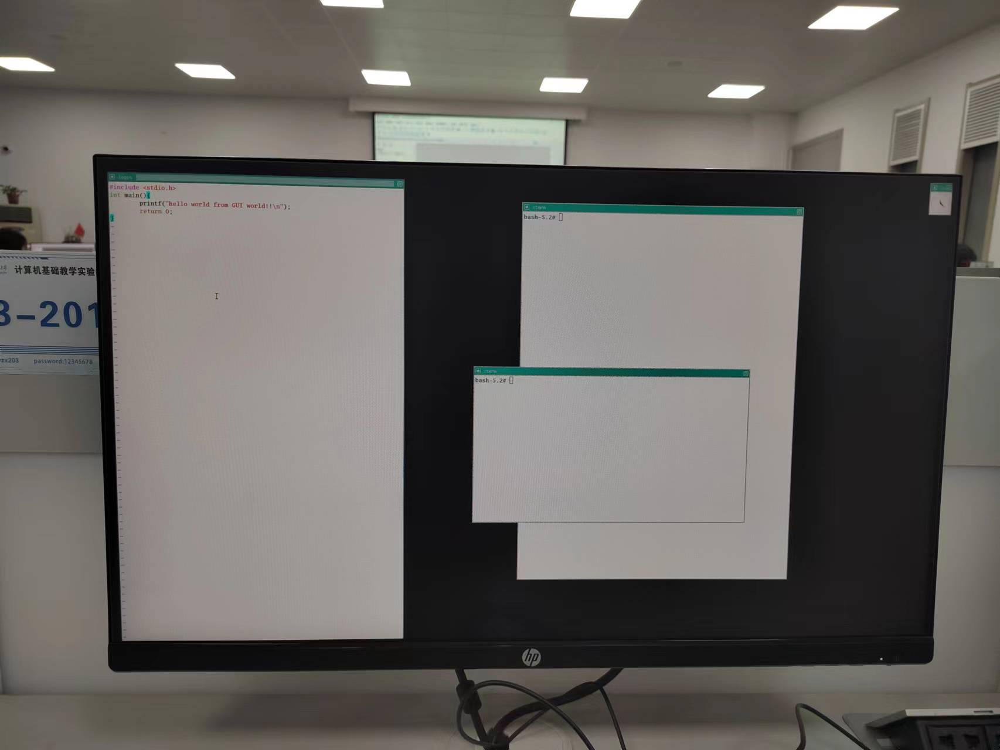
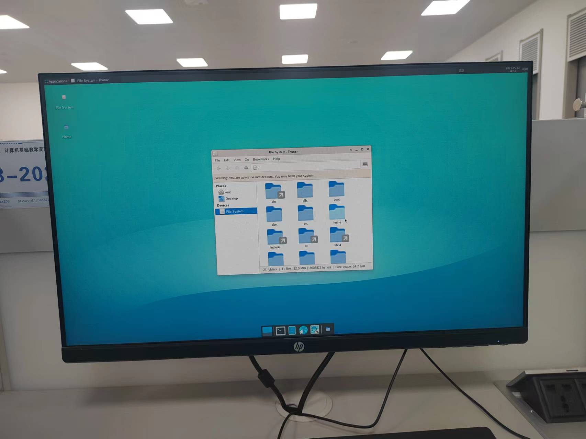
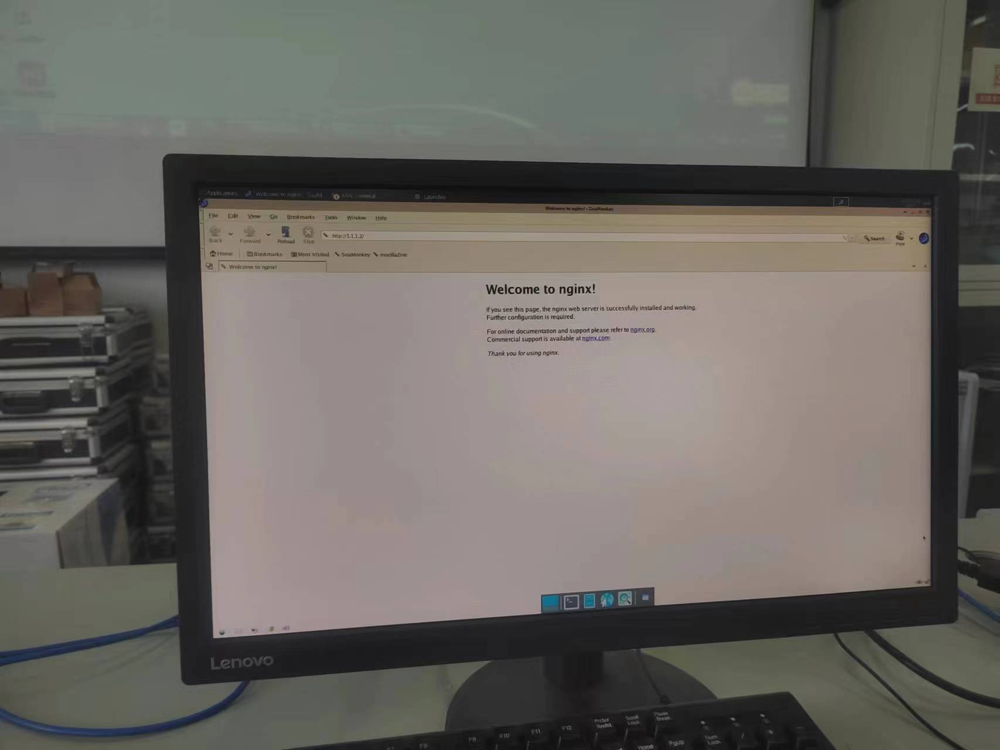
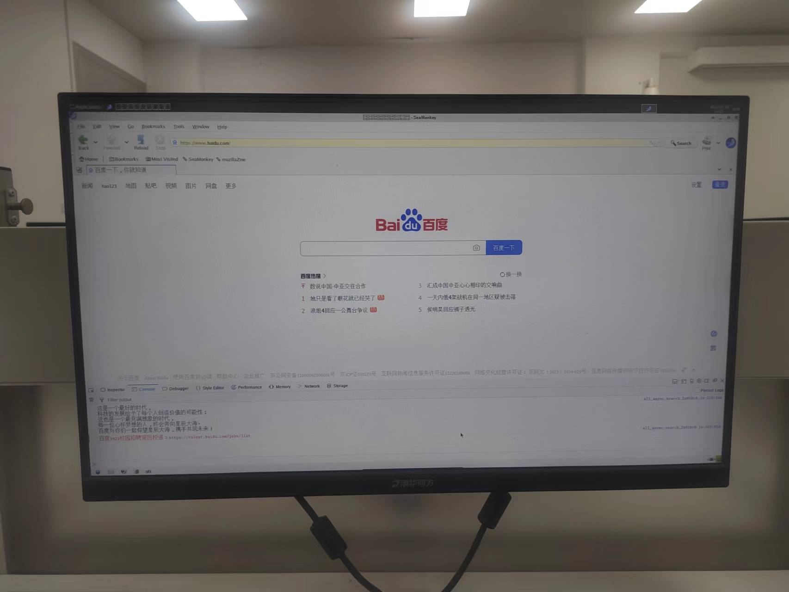

## Motivation

### 从Kernel开始

听说过Linux的人或许听说过*Ubuntu*、*CentOS*、*Open Kylin*(E楼Ⅱ区203电脑装有这个系统)、*Kali*、*RHEL*、*openEuler*、*RHEL*等操作系统，它们都是*Linux*的**发行版**(Distribution);或许也许听说过Linus Torvalds这个人，他是Linux的创建者，管理着[Linux Kernel](https://www.kernel.org/)的主线代码。Kernel翻译成中文叫做内核。一开始我觉得这个词还是很抽象的，Kernel是什么？它在哪里？如果单纯编译一个Linux Kernel的源代码，我就能得到一个实际可用的操作系统吗？根据我个人的经验，Kernel这个词在操作系统课感觉是一笔带过、语焉不详的。当真正去编译Kernel的时候，才了解到一个Kernel并不能组成一个可用的系统，在*QEMU*虚拟机下运行命令

```bash
qemu-system-x86_64 -kernel bzImage # bzImage 是编译Linux Kernel源代码的产物
```

结果往往是内核最终进入panic态（遇到不可恢复错误）,如下图所示：



这启发我们：只有Kernel是不够的，如果想要在QEMU上运行一个**最小可用**的操作系统，还必须要构建一个文件系统，这个文件系统可以在某些块设备上、也可以是在内存中的文件系统（详细情况可看[Linux 中的initrd](https://www.kernel.org/doc/html/latest/admin-guide/initrd.html)）。但一个空文件系统也不能运行我们所希望的交互式命令行，因为命令行本身也是一个程序，Linux内核不包括命令行软件（如Bash、Fish等）的相关代码。那去下载并编译命令行软件的代码，在通常使用Linux发行版（如Ubuntu、CentOS等）上编译是不是就可以在QEMU虚拟机上启动一个可用的Linux内核呢？如果按照默认的编译选项动态链接的话，还是不行，因为命令行软件还会依赖于动态库和动态链接程序(ld.so)，这些Linux Kernel里面也是没有的,同样需要我们自行下载编译和放到到文件系统正确的位置里。当然，如果希望快速得到一个最小可用的Linux内核的话，可以使用下载Busybox的源代码（Busybox包括shell、ls等一些基本命令行程序）并静态编译/链接（运行的时候不依赖于任何库）。因此，从上面可以看出，一个可以在QEMU运行的比较精简的Linux系统包括以下组件：

1、Kernel

2、文件系统（最简单的就是内存文件系统，启动时直接加载到内存的某个位置）

3、一系列的可执行文件（需要静态链接，不依赖glibc等动态库）

这样下来组装下来，一个最小可用的操作系统就不只有内核了，而我们附加的各种软件大多在[GNU](https://www.gnu.org/)下,因此，**准确来说**，这个最小操作系统应该叫做GNU/Linux,而Linux应该指代Linux Kernel，Ubuntu等系统同样基于GNU下的开源软件（数量更加庞大），因此也可以称为GNU/Linux。众所周知，Android也是基于Linux Kernel，但它用户态的组成部件并不是GNU下的软件，因此，我们不会称之为GNU/Linux。正如[GNU官网](https://www.gnu.org/)所说：
 > Unix 操作系统中用于资源分配和硬件管理的程序称为 “内核”。GNU 所用的典型内核是 Linux。该组合叫做 GNU/Linux 操作系统。GNU/Linux 为几百万用户所使用，然而许多人 错误地称之为 “Linux”。

 从上面的例子看到，在GNU/Linux世界里，一个完整的操作系统的组件往往是分散的，但又是分工明确的，粗略地说，内核提供系统调用（在Linux中，当然sysfs等特殊文件系统下的内容也是Application Binary Interface（ABI）的一部分,参考[Linux ABI description](https://www.kernel.org/doc/html/latest/admin-guide/abi.html)），规定其语义（Semantic），并保持稳定，而各种其他组件的开发者则根据这样的约定编写程序，就这样，各种部件和Kernel组合在一起，顺利地运作。什么是Kernel，什么不是Kernel，各种概念的界限也就清晰了。

### 为什么要构建一个桌面操作系统

+ 希望该系统可以在**物理机**上运行，而不是Qemu等虚拟机上运行
+ 希望通过构建的过程了解一个可用的图形界面（GUI）在Linux世界里需要一些什么样的组件
+ *Debian/Ubuntu*、*CentOS*、*RHEL*（Red Hat Enterprise Linux）等Linux发行版都说是开源透明，那么它们应该都能够从源代码构建（至少大部分，Ubuntu中也有不开源的软件），那么它们是怎样构建的呢？我打算先从[Linux From Scratch](https://www.linuxfromscratch.org/lfs/view/stable/)(*LFS*) 和 [Beyond Linux From Scratch](https://www.linuxfromscratch.org/blfs/view/11.3-systemd/)(*BLFS*)开始，它们提供了构建一个软件依赖的其他软件和编译参数（减少了最耗时阅读相关文档的时间，大大缩短了构建一个可用桌面系统的时间）
+ 希望能够上网（需要编译一个浏览器以及其依赖）

### More

大型的开源软件社区一般都有自己运作的一套规则（代码提交、代码风格、版本管理控制工具），阅读[UbuntuDevelopment Wiki](https://wiki.ubuntu.com/UbuntuDevelopment)是很好的开始...

阅读 [A guide to the Kernel Development Process](https://www.kernel.org/doc/html/latest/process/development-process.html) 也是一个好的开始...

## 构建的不同阶段

+ 从U盘启动
  


+ 一开始由于无法挂载根文件系统，内核panic



+ 初步构建完整的命令行环境





+ 初步构建基本的窗口显示



+ 构建相对完整的xfce环境



+ 测试Nginx服务器



+ 测试SeaMonkey浏览器，能浏览网页，但不能播视频


