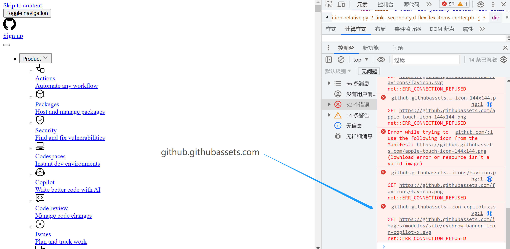
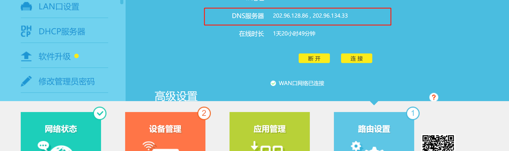
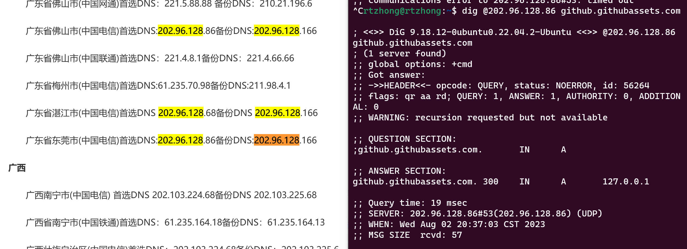
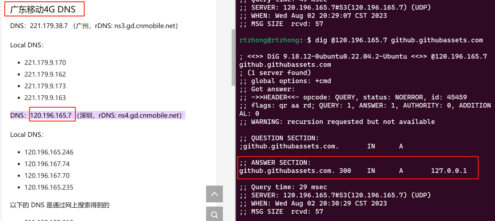
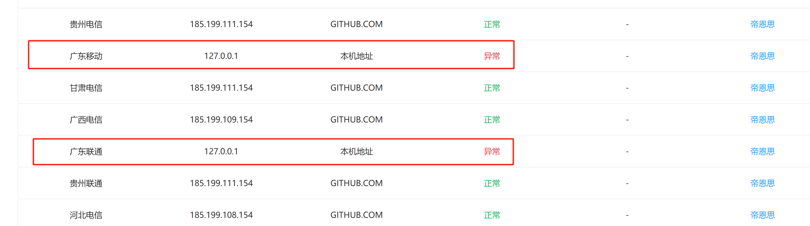

## 起源

今天上网冲浪的时候境外网站Github只能加载一部分，发现所有对github.githubassets.com访问全部报“ERR_CONNECTION_REFUSED”,如图1所示：

 

## 排查过程

运行nslookup后发现改该地址解析到127.0.0.1,很显然这是一个本机环回地址(loopback),不可能是Github的公网IP。像这种请求域名A的IP地址却返回了一个无效的IP地址，或者，返回了域名B的IP地址（比如请求谷狗的IP，却返回了Meta的机房IP），一般叫做DNS劫持/污染。由于在WIFI局域网下的PC的DNS服务器一般来说是路由器自己(电脑上看到的DNS服务器IP地址是192.168.0.1，然后路由器又去请求外部的DNS服务器，为了排除路由器本身的问题，又登录了路由器管理界面，找到了真正的DNS服务器的地址（中国电信)(图2)，并对其DNS劫持的问题进行验证（图3）。那么中国移动的DNS服务是否也会有类似问题呢？手机开启热点，查看DNS手机使用的DNS地址，并发现了同样的问题（图4）。

 

 

 

## 验证

地域问题也需要考虑，不同地方的情况可能不一样，因此使用www.boce.com对全国不同地区不同运营商的DNS进行查询，发现有且仅有广东地区的运营商出现DNS劫持问题，不知道是幸运还是不幸。解决办法很简单，手动设置一下DNS服务器就行了，比如设置为Cloudflare的1.1.1.1，但遇到更大范围和强度的污染时，可能就要考虑其他更复杂的手段了（DoH，ESNI and beyond ）

 
