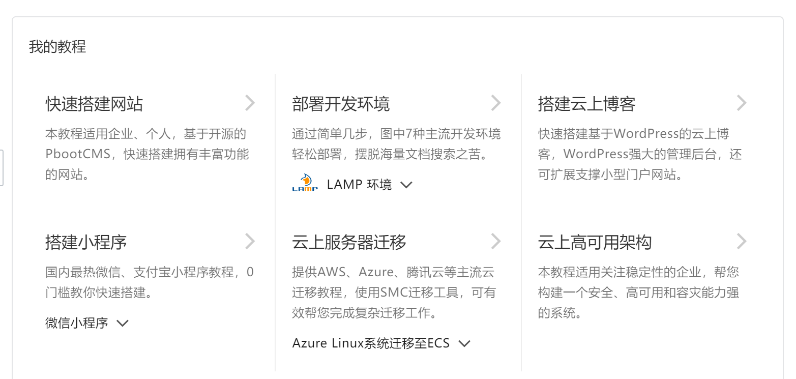
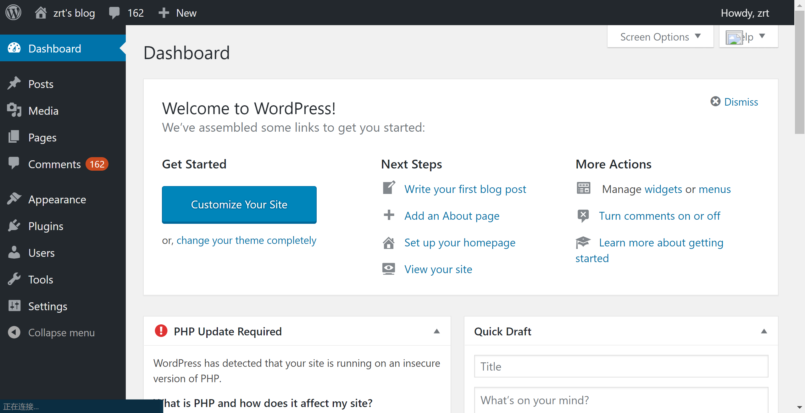
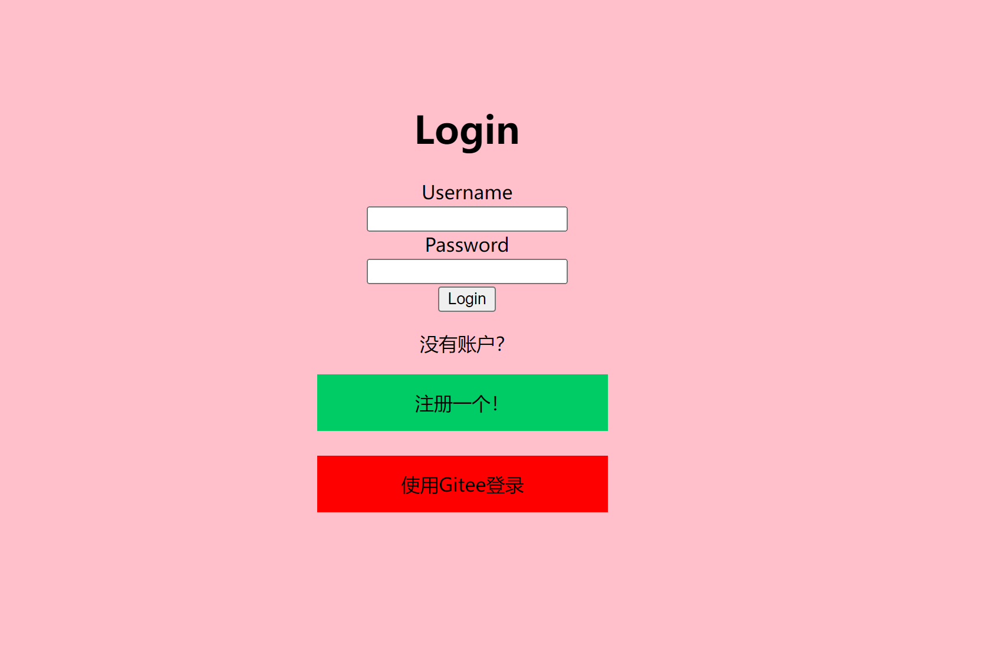

# 云服务器

笔者在2022年2月份的时候趁着便宜租了阿里云的服务器，配置为`1核(vCPU) 2 GiB`，当时续一年需要87元左右，一共续了两年，这个价格一直是浮动的，现在同样配置续期一年需要1234元（2022年8月25日）。当然对于新注册用户而言，有更大力度的优惠，如果只是想体验一个月的话，大概1块钱就行（2022年8月25日）。值得一提的是，阿里云，学生有两周ECS服务器免费使用权，若提交试用报告审核成功后还可以续期两个月。

个人认为云服务器如果不是价格特别便宜(老客户优惠比较少），不太适合没有固定收入的学生使用，毕竟，如果想学习服务器编程，在**Windows Subsystem for Linux**(WSL)中也可以进行，安装Linux虚拟机或者Linux+Windows双系统都是性价比比较高的选择，github.io和技术论坛可能是比较好的选择。

[腾讯云](https://cloud.tencent.com/)

[阿里云](https://www.aliyun.com/)

[阿里云学生页面](https://developer.aliyun.com/plan/student?spm=5176.21213303.4134825510.1.2b8853c9Zul9t0&scm=20140722.S_card@@%E5%95%86%E5%93%81@@1624683.S_cardgbdt.ID_card@@%E5%95%86%E5%93%81@@1624683-RL_%E5%AD%A6%E7%94%9F-OR_ser-V_2-P0_0)

在云服务器上建站最好先学习一下Linux命令行，个人认为云服务器可玩性比较强，因为云厂商提供了较为丰富的入门教程，上手比较快。

使用ssh登录

```bash
 _   _      _ _          ___                     _________ _____
| | | | ___| | | ___    |_ _|   __ _ _ __ ___   |__  /  _ \_   _|
| |_| |/ _ \ | |/ _ \    | |   / _` | '_ ` _ \    / /| |_) || |
|  _  |  __/ | | (_) |   | |  | (_| | | | | | |  / /_|  _ < | |
|_| |_|\___|_|_|\___( ) |___|  \__,_|_| |_| |_| /____|_| \_\|_|
                    |/
root@114.55.89.***'s password:
Last failed login: Thu Aug 25 01:54:49 CST 2022 from *.*.*.* on ssh:notty
There was 1 failed login attempt since the last successful login.
Last login: Wed Aug 24 23:53:26 2022 from *.*.*.*

Welcome to Alibaba Cloud Elastic Compute Service !
```

## Linux + Apache + MySql + PHP（LAMP）

这也是非常常见的``LAMP``架构了，其中Apache是服务器，MySql是数据库，无论是腾讯云还是阿里云都提供了较为详细的安装教程，基本上按照提示复制粘贴就能把所有东西都配置完成，温馨提示：如果一定要使用CentOS，请使用7.x版本，而不是8.x版本，8.x版本按照教程来会出错，出现无法下载的情况，推荐使用其他Linux发行版，如Ubuntu等。



如下图，就是用WordPress搭建的一个网站，WordPress自带DashBoard可以编辑文章，和基于Github Pages的博客相比，学习成本较低，自带用户管理和评论区功能，可以较快上手，同时有一些插件支持Markdown写作。而对于基于Github Pages的博客而言，增加评论区一般要添加其它依赖，较为繁琐。



## Java + Spring Boot

**Java**的``Spring Boot``是动态网站常用的框架。*静态网站*上的东西顾名思义是静态的，每个人访问都是一样的结果，比如说某人写的一系列文章，互联网早期大多数网站都是静态网站，而 *动态网站* 则可以根据不同的请求或用户发送的不同请求返回不同的页面，比如说用户的登录界面，甚至说OAuth协议下的第三方登录,基于此可以做出非常灵活和有意思的应用。而WordPress其实既有动态部分也有静态部分。

推荐使用阿里云的Cloud Toolkit将应用程序打成*Jar包*，远程部署，效率实在是高，这个工具在主流的Java IDE中以插件的形式存在。



## 其他

服务器比较其中比较重要的资源就是珍贵的公网IP了，比如说可以作为IM软件（即时通信，如微信）的中继服务器。其实很多应用在本地机就可以运行，如Spring Boot，部署到服务器上除了能够把你的网站或服务开放给别人之外，也迫使你学习部署和运维的一些技巧，了解到生产环境的工作全流程，个人认为这也是现在似乎广受推崇的DevOps的一种体现。

# Github Pages

[Github Pages](https://pages.github.com/)提供了username.github.io的域名，将代码仓库里的markdown格式的文件转换为网站。借助Github Actions，经过一定配置后，可以在每一次仓库的push动作后自动集成，自动部署，十分方便。

本网站使用的就是[Hugo](https://gohugo.io),官网有非常详细的教程，通过配置文件的方式来定制自己喜欢的网站风格和布局。

个人总结了一下在github上建站的几点**好处**：

+ **免费**，不用租服务器。
  
+ 对于喜欢用**Markdown**写作的人来说是福音，没有过多的插件需要下载。
  
+ 方便迁移，全部文章以**Markdown**格式存储，在框架的帮助下，相同的文件既可以在自己的服务器上部署，也可以在github.io上部署。

+ **Github Actions**提供了持续集成/持续部署的服务（CI/CD），简单来说，只要仓库有新的push（配置更改或新文章），整个网站就会在后台自动重新生成一遍。
  
  **缺点**

+ 配置项多，编辑起来不如CSDN、WordPress直观。
+ 访问速度受限，不适合插入过多的图片

# 技术论坛

如果不想折腾，在技术论坛上开一个账号也是很方便快捷的，比如说CSDN、稀土掘金、infoQ等网站。主流的技术论坛一般都支持**Markdown**，排版上无需消耗过多的精力。同时，如果文章中有大量图片等静态资源的话，这些论坛在**CDN**服务器的帮助下，加载起来比较迅速，而自建服务器和Github Pages的带宽有限，加载速度一般。
