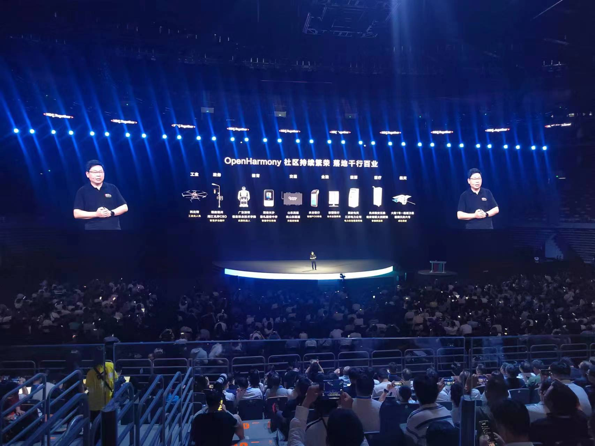
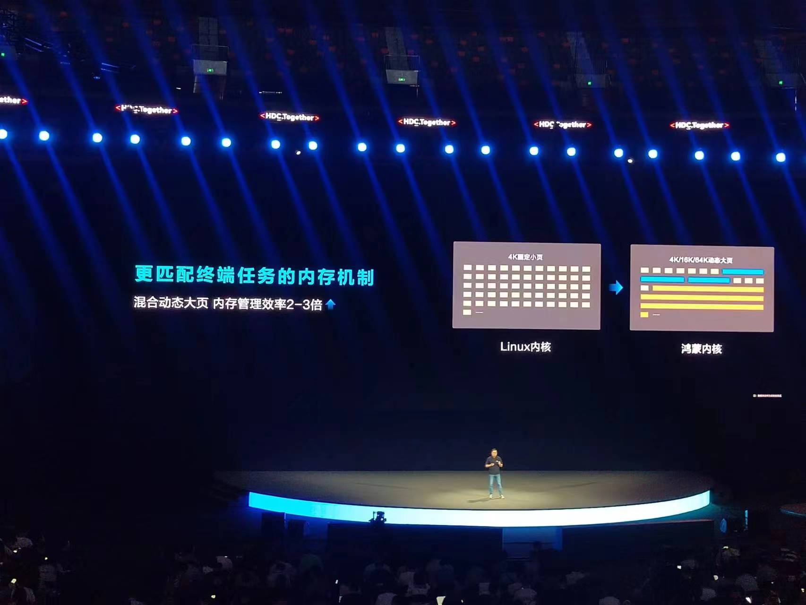
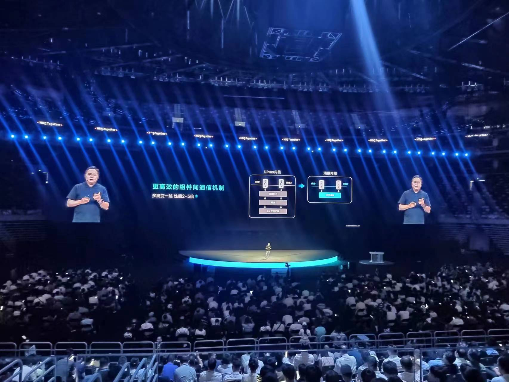
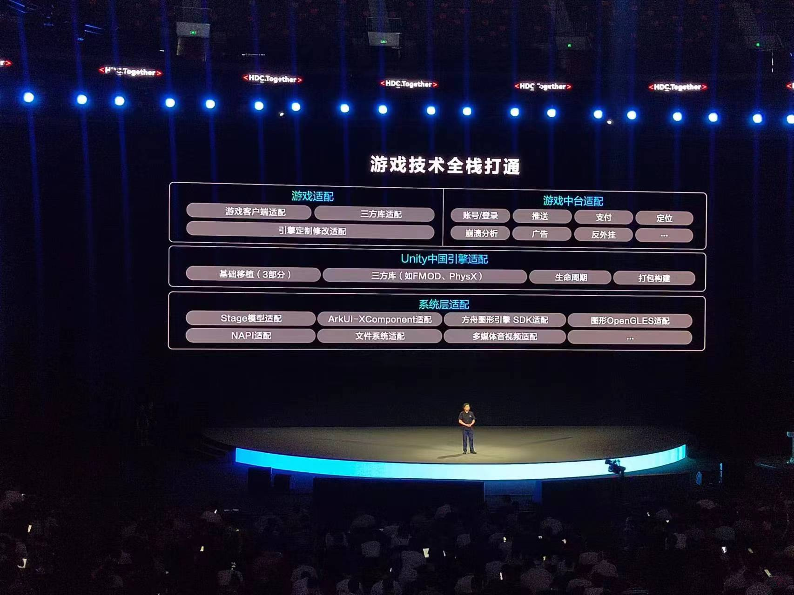
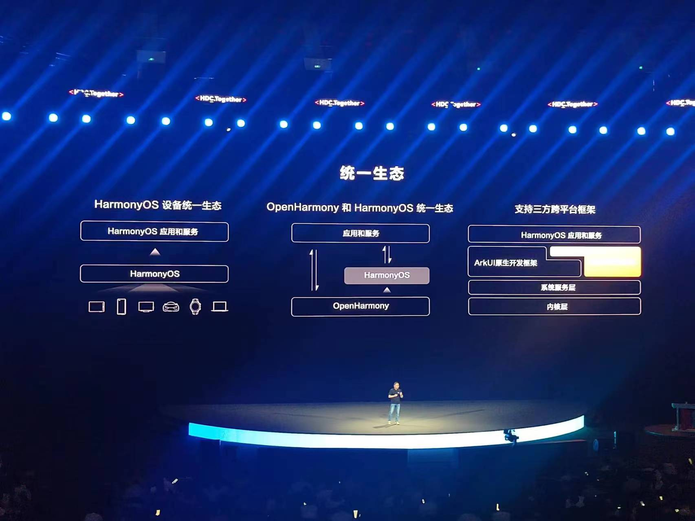
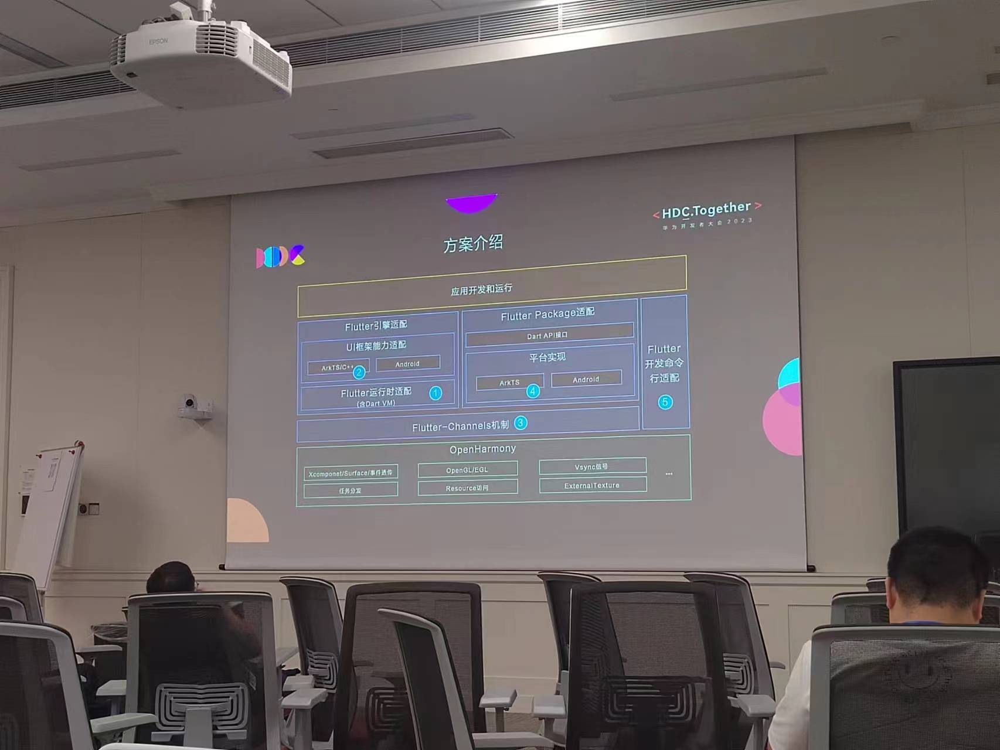
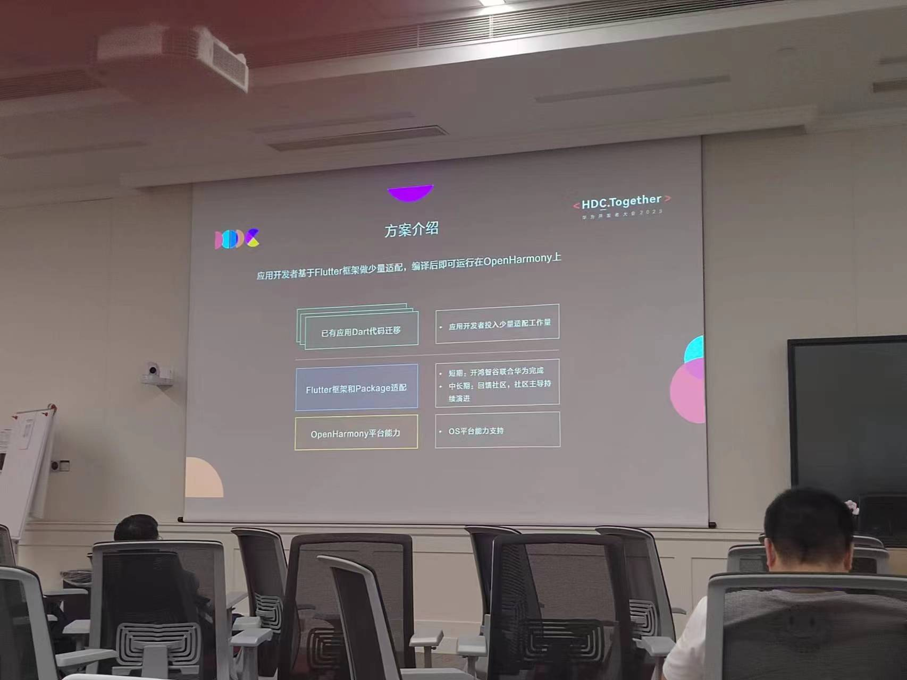
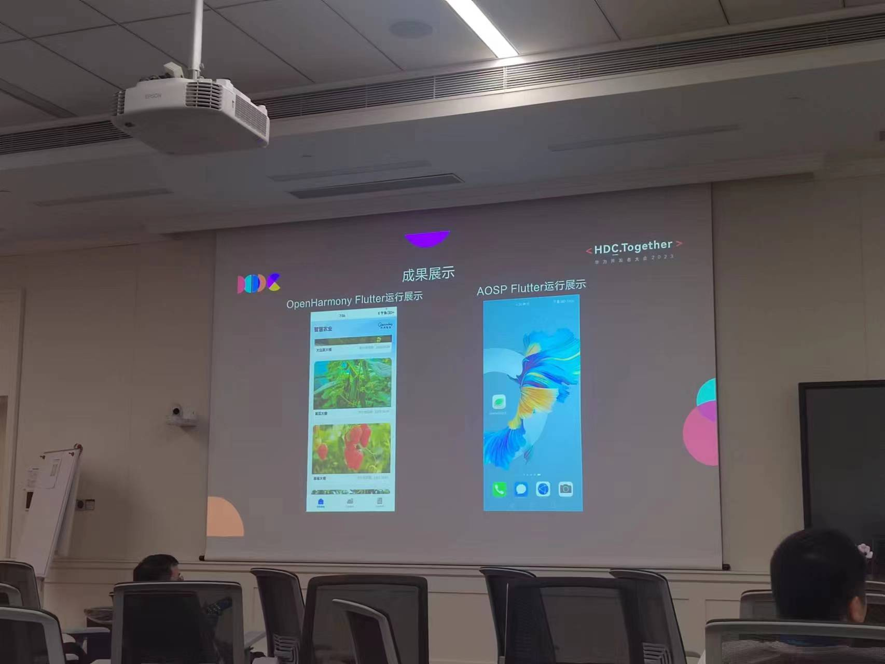

## Day 1(2023.08.04)

### 发布会概述

Harmony OS 4 的发布会介绍了一些新的功能，让我印象比较深刻的有细粒度的防追踪功能，可以开启或关闭某个应用的追踪功能，虎嗅之前的一篇文章解释其中大概的原理（[Android 10之后，国产应用这样对你进行广告追踪](https://mp.weixin.qq.com/s/l7L8I4xkBidQ8mb1GEtwNQ)），我目前使用的荣耀手机可以重置广告标识符 （OAID）或禁止广告追踪，但做不到细粒度（无法控制单个应用的权限）。

还有另外一个感觉比较好的功能就是超级中转站，它把不同设备上的不同元素汇聚在一起，从而使得编辑文章的过程比较高效。

### 和开发者比较相关的部分

前面两个人的演讲主要介绍Harmony OS 4，更多的是功能和用户交互上的更新。而第三个人的演讲和开发者联系更大一些，我印象比较深刻的地方：

+ 介绍了Open Harmony 和 Harmony OS 的关系（基座？其实还是很模糊）
+ 介绍了鸿蒙内核（微内核，介绍了几个优化，安全模块经过形式化证明）
+ 介绍了倩女幽魂手游移植到Harmony OS上的情况（包括Unity的移植）（C# call js）
+ Harmony OS Next
+ 支持React Native & Flutter等框架（好奇怎么实现的？）

### 个人看法

+ 官方说鸿蒙内核是微内核，从图中看得出很多功能都从内核中移走了，应用通过进程间通信来调用处于内核外的各种服务（如文件系统、设备驱动、内存管理等模块）
+ 进程间通信的优化：既然需要大量的进程间通信来调用各种服务，那么它成为一个需要优化的瓶颈，优化方法包括但不仅限于共享内存减少拷贝次数、绕过调度器“直接进程切换”等等
+ 动态大页：其实Linux内核也有大页机制，是否有动态大页有待研究
+ 负载追踪、群组调度：有点像Linux里面处理器调度域

## Day 2（2023.08.05）

### 开发者讲座

+ 华为的账号体系（在多设备之间的流转比较重要），对标Apple ID
+ 扫码：将扫码功能下沉到操作系统提供的服务，通过API调用直接扫码，无需用户授予相关权限，同时对扫码进行特殊优化，加快相应速度
+ 云存储（Cloud Drive）：开发者可以把部分数据存到特定的目录中（该目录会在云端和本地同步，很好的抽象），使得同一账号的不同设备之间可以同步
+ 消息推送（Push）：重要信息和不重要的信息分开，提高用户的点击率
+ 印象比较深刻的是对Flutter、Weex、UniApp、Taro等框架的适配，对Electron等框架的适配还在开发当中

### Harmony OS 4 体验

+ 体验了天气主题壁纸、中转站、细粒度的追踪权限管控以及全新小艺
+ 中转站确实好用，点赞！
+ 小艺体验了对话和PDF摘要生成的功能，只不过这两个功能只能分别在两台手机上体验，而我让小艺写了一段比较复杂的代码，一开始出来了结果，后面却直接转为一段提示语，问了工作人员，这是被风控了，展示机上的风控比较严格。

### 后续规划

+ Harmony OS的开发流程和官方服务的调用
+ 能否构建OpenHarmony from scratch？（有显示屏的开发板）
+ 深入理解框架适配（尤其是Flutter）？

