## 背景

本学期有门课叫做“操作系统课程设计”，要求对一个教学操作系统Pintos的代码按照要求进行修改。

课程提供了一个已经配置好的云端环境供学生进行各种操作（`图1`）。老师也提供了在本地电脑配置的文档（《Pintos安装手册》），但表示在较新版本上的安装未经验证。笔者进行了分别在Windows Subsystem Linux 2（WSL2）和物理机上的Ubuntu 22.04 LTS上分别进行验证，完全按照安装手册指示来做，出现Pintos反复重启，无法进入预期界面的情况（`图2`），上网也找不到相关资料，故进行了一些研究，大家可以参考一下。

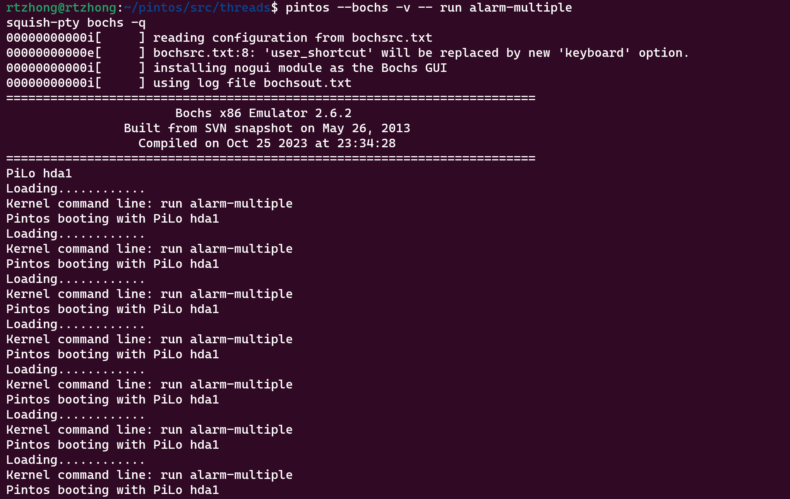

## 分析过程

### 谁的问题

对比云端环境和本地环境的编译过程后发现，本地环境使用gcc编译器（套件）进行编译，而云端环境有两个编译器，一个是gcc，一个是i386-elf-gcc（`图3`）实际编译使用的是i386-elf-gcc，通过修改PATH环境变量，强迫云端环境使用gcc编译后，云端环境同样出现了和本地环境相同的问题（`图4`），这提示问题很有可能出在编译过程中。

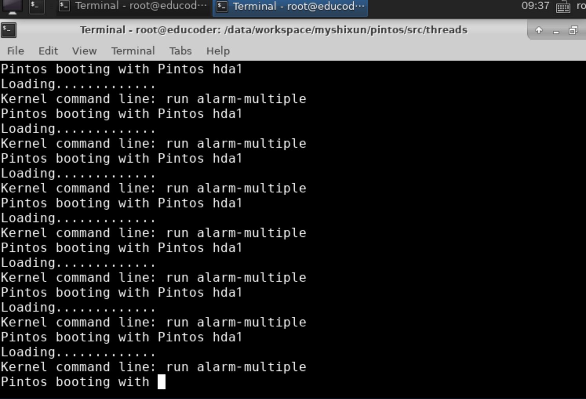
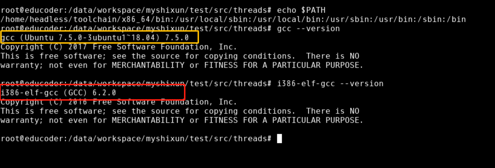

### 对比`kernel.bin`

对比i386-elf-gcc和gcc编译出的kernel.bin,发现gcc编译出来的kernel.bin中有诸如`.text.__x86.get_pc_thunk.si`等段名（`图5`），而另外一个没有。这些段所标识的函数用来进行数据的相对寻址（指令地址+一定偏移量），比如某个指令执行的时候可以使用（PC值+偏移量）找到一个变量的地址，这样以后，对数据的访问不依赖于变量加载的地址，只需要保持数据和指令的相对位置不变即可，这样的代码叫做*Position Independent Code* (**PIC**)。由于在32位机器中不支持相对%rip寻址，因此出现了__x86.get_pc_thunk.si这种函数，简单来说，这个函数将下一条指令的地址的值赋给esi寄存器，然后下一条指令可以利用（esi寄存器的值+固定的偏移量）的值寻址到想要的变量（感兴趣的可以研究一下它的实现，就两条指令，比较巧妙）。

这提示问题很有可能和编译器的PIC配置有关。

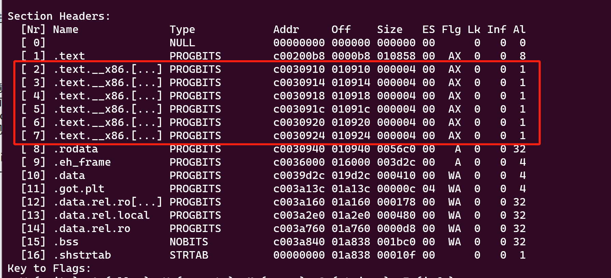
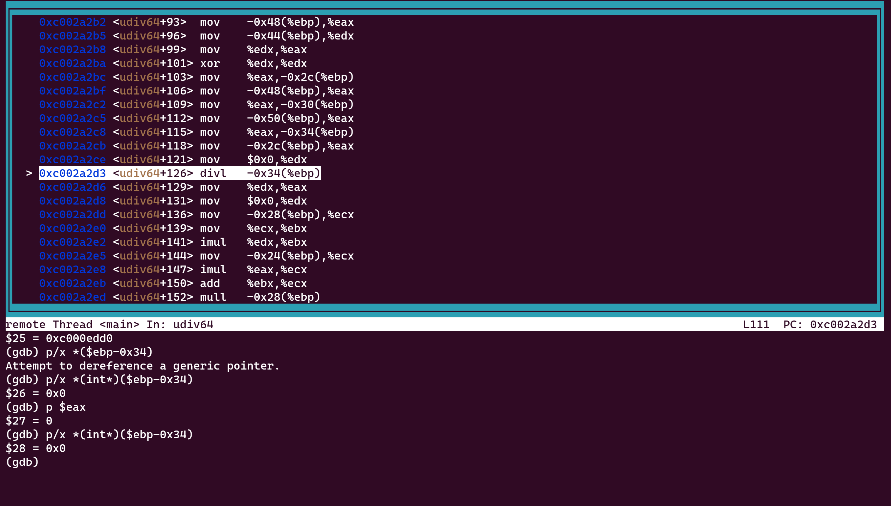

### 通过调试发现根本原因

经过定位，问题出现在src/lib/stdio.c:510(*cp++ = b->digits[value % b->base];)，由于b->base==0，出现除零错误(`图6`)，导致了Pintos反复重启。进一步发现b==0xc003a298，指向的是一个全局静态变量（base_d）(`图7`),而该全局静态变量已经初始化（b->base=10）(`图8`）,因此可以猜测该变量在此除零错误之前被修改或清零。已知bss_init()会对存放未初始化的全局变量的BSS段全部清零，怀疑bss_init()误清零。因此查看该段代码，发现它**错误地**将不属于BSS段的区域（base_d所在区域）清零（`_start_bss<&base_d<_end_bss`)（`图9`），调试时发现在执行memset函数清零之前base_d的值正是它当初初始化的值，而memset执行后base_d所有内容都变为0（图9未显示这个过程）。

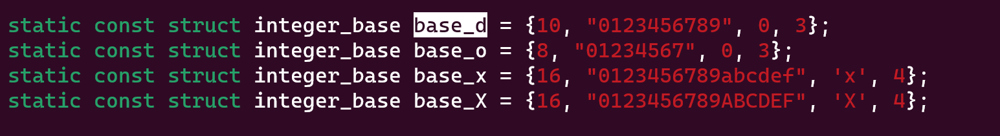
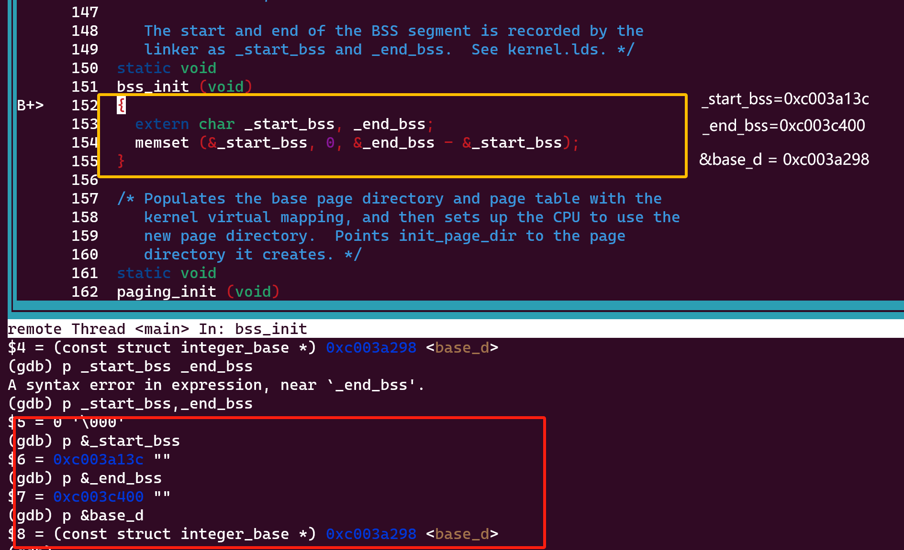

从链接脚本可以看出（src/threads/kernel.lds.S），它错误地假定了data段后就是需要清零的bss段（`图10`），实际上在生成位置无关代码(gcc)的时候data段和bss段之间还有一些有用的段（比如base_d就在.data.rel.ro.local段中）（`图11`），程序出现错误；而如果不生成位置无关的代码(正确的情况，也就是使用i386-elf-gcc)，则base_d位于.rodata段中，在.data段之前，因此对.data后的段清零没有影响，程序正确（`图12`）。

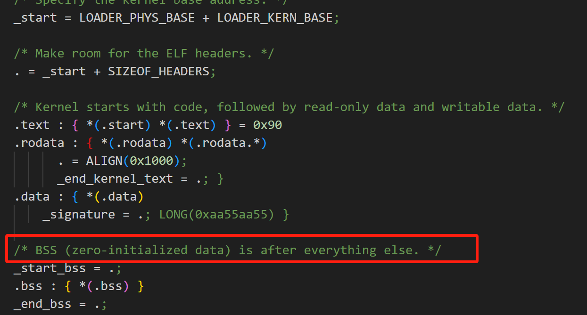
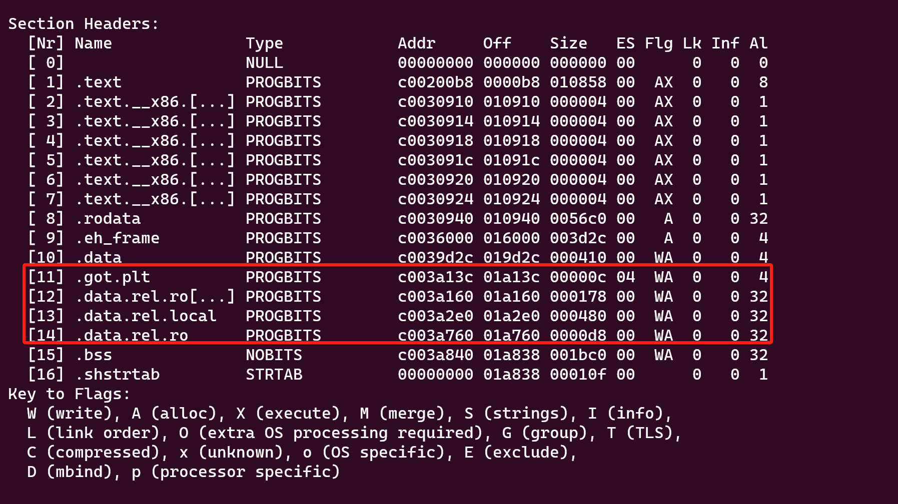
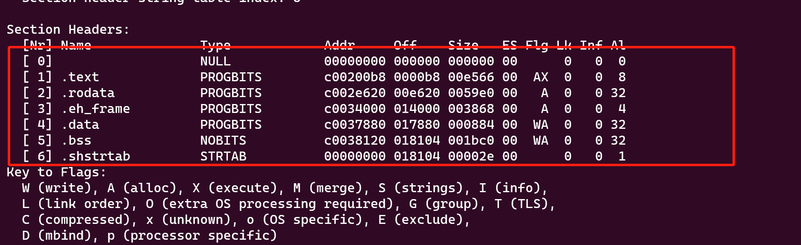

### 原因小结

由于Pintos假定.data段后面就是bss段（需要清零），当编译器生成位置无关代码时，部分数据位于.data段和.bss段之间，这些数据被清零，当使用到这些数据以后（比如说value%b->base)，程序发生错误，无法启动（错误在bss_init()就已经发生，后面发生除零错误才暴露出来）。

## 解决办法

使用-fno-pic禁止GCC产生位置无关的代码，src/Make.config中的CFLAGS = -m32  -g -msoft-float -O0修改为CFLAGS = -m32  -fno-pic -g -msoft-float -O0，在WSL2和物理机上的Ubuntu 22.04 LTS上均经过验证。
注意：

1. 如果已经编译过代码，请在threads目录下运行make clean
2. 修改了编译选项后其他所有操作按照《Pintos安装手册》进行，比如操作顺序和bochs的版本）

## 讨论

1. 云端环境的i386-elf-gcc和gcc有什么区别？

根据云端环境的i386-elf-gcc的版本，推测云端是根据src/misc/toolchain-build.sh这个脚本文件构建的，理论上根据这个脚本构建出的i386-elf-gcc能够使得Pintos正常工作（未经验证）。

步骤大概是：

1. 通过包管理工具安装GCC
2. 下载6.2.0的GCC源码以及相关依赖
3. 使用GCC编译出target为i386-elf的i386-elf-gcc（有点交叉编译的感觉，学嵌入式的同学应该比较了解）。

这种方法下载和编译需要花一些时间，此外，GCC本身就支持编译i386的二进制文件，能用一个编译选项解决的问题没有必要在电脑上装两个占用硬盘空间的编译器。而具体是什么导致了两种编译器默认行为的差异还有待研究。

2. src/threads/kernel.lds.S链接脚本中只出现了.text、.rodata、.data、.bss段，最终一些在链接脚本中未出现的段却插入了这些段之间当中？（这些段插入的顺序甚至影响了程序的正确性，如果生成位置无关代码的时候，.data.rel.ro.local等段位.data等段之前，它就不会被误认为.bss段而被清零）

这些没有指明的段叫做Orphan Section（`图13`），简单来说，对于链接脚本没有指明的段，链接器会尽可能将属性相近的段放在一起，这也导致了一些没有指明但有用的段放在了.data段后面，违背了Pintos的假设。

具体可以参考链接器[ld的文档](https://sourceware.org/binutils/docs-2.37/ld.pdf)

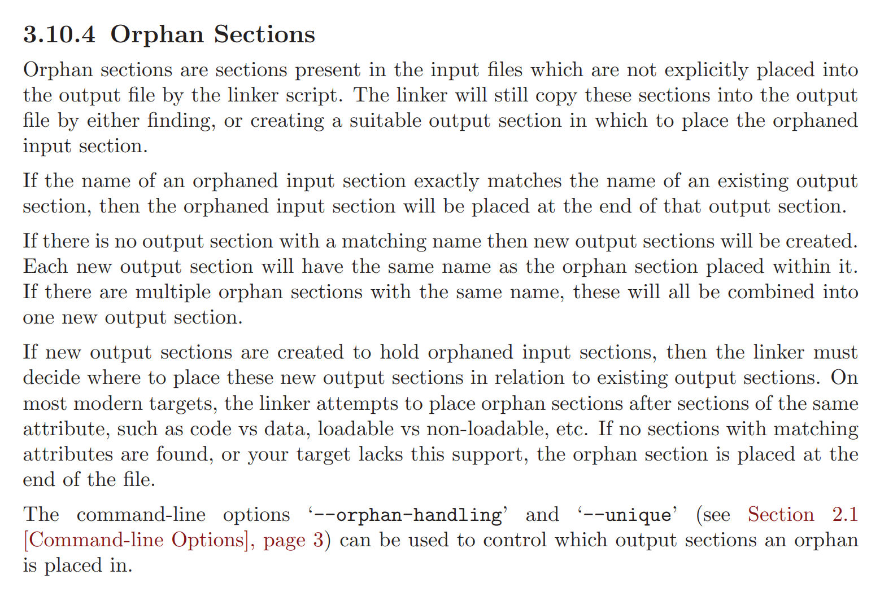
